[github](https://github.com/Chin-Wee) &nbsp;·&nbsp;
[repositories](https://github.com/Chin-Wee?tab=repositories)

> Senior developer and software architect based in Singapore. 
> Real-time systems, graphics, simulation, and practical engineering.

I build systems where visual quality, runtime performance, and maintainable architecture
have to coexist. Most of my current work sits between game technology, WebGPU rendering,
simulation-heavy backends, developer tooling, and applied research.

<samp>typescript &nbsp; javascript &nbsp; python &nbsp; c# &nbsp; godot &nbsp; three.js &nbsp; webgpu &nbsp; react &nbsp; next.js &nbsp; fastapi &nbsp; postgres &nbsp; docker &nbsp; git &nbsp; linux</samp>

**[hex-map-wfc](https://github.com/Chin-Wee/hex-map-wfc)** &nbsp;·&nbsp; <samp>typescript, three.js, webgpu</samp> 
Procedural medieval island worlds assembled from 4,100 hex tiles, with modular
Wave Function Collapse, recovery passes, and a performance-focused render stack.

**[retail-portfolio-backtesting](https://github.com/Chin-Wee/retail-portfolio-backtesting)** &nbsp;·&nbsp; <samp>python</samp> 
An auditable research pipeline for testing monthly S&P 500 purchase policies,
selection discipline, holdout evaluation, and low-effort strategy stacking.

**[Donuts](https://github.com/Chin-Wee/Donuts)** &nbsp;·&nbsp; <samp>next.js, react three fiber</samp> 
A static interactive 3D gallery with draggable procedural donuts, responsive
editorial layouts, physics, reduced-motion support, and a GitHub Pages export.

Every graphic is committed to this repository and generated without an external
profile-stat service. `scripts/generate_stats.py` reads public GitHub activity,
draws the SVGs with the Python standard library, and a scheduled workflow refreshes
them daily.

The SVGs use a system monospace stack, adapt to GitHub light and dark themes, and
animate with SMIL because scripts are stripped from README content. The visual
direction is inspired by [andriidrok1/andriidrok1](https://github.com/andriidrok1/andriidrok1);
the implementation and content here are original.
